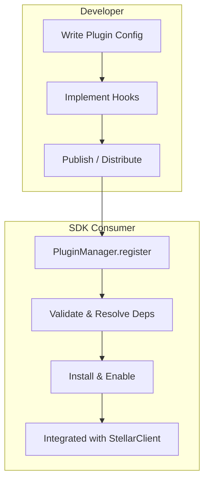

# Plugin Architecture

> Extend the Axionvera SDK without modifying the core codebase.

---

## Table of Contents

- [Overview](#overview)
- [Quick Start](#quick-start)
- [Core Concepts](#core-concepts)
  - [Plugin Manifest](#plugin-manifest)
  - [Lifecycle State Machine](#lifecycle-state-machine)
  - [Hooks](#hooks)
  - [Dependency Injection (Service Overrides)](#dependency-injection-service-overrides)
  - [Middleware](#middleware)
- [Plugin Validation & Compatibility](#plugin-validation--compatibility)
- [Plugin Registry](#plugin-registry)
- [API Reference](#api-reference)
  - [PluginManager](#pluginmanager)
  - [PluginRegistry](#pluginregistry)
  - [Validation Utilities](#validation-utilities)
- [Examples](#examples)
- [Best Practices](#best-practices)
- [Troubleshooting](#troubleshooting)

---

## Overview

The plugin architecture enables **third-party developers** to extend the Axionvera SDK with custom:

- **Transaction builders** — custom Soroban contract interactions
- **Authentication mechanisms** — custom wallet connectors or signers
- **Analytics & telemetry** — custom logging, metrics, and monitoring
- **Protocol integrations** — bridge adapters, oracle integrations, etc.
- **Middleware** — intercept and transform RPC requests/responses

Plugins are **self-contained** modules that register with the `PluginManager`, which manages their lifecycle, validates compatibility, resolves dependencies, and integrates them with `StellarClient` instances.



---

## Quick Start

### 1. Define a Plugin

```typescript
import { PluginConfig } from 'axionvera-sdk';

const myPlugin: PluginConfig = {
  id: 'com.example.my-plugin',
  name: 'My Custom Plugin',
  version: '1.0.0',
  description: 'Adds custom analytics to every RPC call.',

  compatibility: {
    minSDKVersion: '2.0.0',
  },

  hooks: {
    onInstall: async () => {
      console.log('MyPlugin installed!');
    },
  },
};
```

### 2. Register and Install

```typescript
import { PluginManager } from 'axionvera-sdk';

const manager = new PluginManager({
  sdkVersion: '2.0.0',
  autoInstall: true,       // Install immediately on register
});

manager.register(myPlugin);
// Plugin is now installed and active
```

### 3. Use with StellarClient

```typescript
const client = new StellarClient({ network: 'testnet' });

// Apply all active plugins to the client
await manager.applyToClient(client);

// Or process options through plugins before init
const processedOptions = await manager.processClientOptions({
  network: 'testnet',
});
```

---

## Core Concepts

### Plugin Manifest

Every plugin starts with a **manifest** — metadata that identifies and describes the plugin:

| Field | Type | Required | Description |
|-------|------|----------|-------------|
| `id` | `string` | ✅ | Globally unique identifier (reverse-domain recommended) |
| `name` | `string` | ✅ | Human-readable name |
| `version` | `string` | ✅ | Semantic version (`X.Y.Z`) |
| `description` | `string` | | Short description |
| `author` | `string` | | Author or organization |
| `license` | `string` | | SPDX license identifier |
| `compatibility` | `PluginCompatibility` | ✅ | SDK version constraints |
| `dependencies` | `PluginDependency[]` | | Other plugins this one depends on |
| `keywords` | `string[]` | | Tags for discovery |

### Lifecycle State Machine

Every plugin moves through a well-defined lifecycle:

```
Unregistered → Registered → Installed → Active
                 ↑  ↓           ↓  ↑       ↓
                 └──┘       Disabled  ←───┘
                                ↓
                            Uninstalled
```

| State | Meaning |
|-------|---------|
| `Unregistered` | Not yet known to the `PluginManager` |
| `Registered` | Known and validated, but not installed |
| `Installed` | Dependencies resolved, `onInstall` called, ready |
| `Active` | `onEnable` called; hooks & middleware are executing |
| `Disabled` | Temporarily paused (`onDisable` called) |
| `Error` | An error occurred; `onError` called |
| `Uninstalled` | Removed from the system |

**Transitions are enforced** — attempting an invalid transition (e.g., `Unregistered → Active`) throws `InvalidPluginTransitionError`.

### Hooks

Plugins hook into the SDK lifecycle via the `PluginHooks` interface. **All hooks are optional**.

| Hook | When Called | Use Case |
|------|-------------|----------|
| `onRegister()` | Plugin is registered with the manager | One-time setup |
| `onInstall()` | Plugin is installed (dependencies resolved) | Async initialization |
| `onEnable()` | Plugin becomes active | Start timers, open connections |
| `onDisable()` | Plugin is temporarily disabled | Pause timers, close connections |
| `onUninstall()` | Plugin is removed | Cleanup resources |
| `beforeClientInit(options)` | Before `StellarClient` constructor runs | Modify client options |
| `afterClientInit(client)` | After `StellarClient` is constructed | Register middleware, listeners |
| `onError(error)` | Plugin encounters an error | Logging, recovery |

### Dependency Injection (Service Overrides)

Plugins can override SDK services through the `services` field:

```typescript
const plugin: PluginConfig = {
  id: 'com.example.custom-logger',
  name: 'Custom Logger',
  version: '1.0.0',
  compatibility: { minSDKVersion: '2.0.0' },

  services: {
    // Replace the default logger
    loggerFactory: () => new MyCustomLogger(),
    // Or provide a pre-built instance
    logger: new MyCustomLogger(),
  },
};
```

Supported overrides:
- `rpcClientFactory` / `rpcClient` — Custom RPC client
- `httpClientFactory` / `httpClient` — Custom HTTP client  
- `loggerFactory` / `logger` — Custom logger
- `webSocketManagerFactory` / `webSocketManager` — Custom WebSocket manager

### Middleware

Plugins can inject middleware that intercepts RPC requests:

```typescript
const plugin: PluginConfig = {
  // ...
  middleware: [{
    name: 'request-timer',
    async pre(context) {
      context.metadata.startTime = Date.now();
    },
    async post(context) {
      const elapsed = Date.now() - (context.metadata.startTime as number);
      console.log(`${context.operation} took ${elapsed}ms`);
    },
  }],
};
```

---

## Plugin Validation & Compatibility

### Automatic Validation

When a plugin is registered, the `PluginManager` automatically validates:

1. **ID format** — alphanumeric with dots/hyphens (e.g., `com.example.my-plugin`)
2. **Semver version** — must be valid `X.Y.Z` format
3. **SDK compatibility** — checks `minSDKVersion` and `maxSDKVersion` against the running SDK
4. **Dependencies** — validates `minVersion` format on declared dependencies

### Compatibility Strategy

```typescript
const plugin: PluginConfig = {
  compatibility: {
    minSDKVersion: '2.0.0',       // Plugin requires SDK >= 2.0.0
    maxSDKVersion: '3.0.0',       // Plugin works up to SDK 3.0.0
    testedSDKVersions: ['2.0.0'], // Known-good versions
    environments: ['node', 'browser'], // Target runtimes
  },
};
```

Set `allowIncompatible: true` on the `PluginManager` to bypass compatibility checks (with warnings):

```typescript
const manager = new PluginManager({
  allowIncompatible: true,
  sdkVersion: '2.0.0',
});
```

### Dependency Validation

Plugins can declare dependencies on other plugins:

```typescript
const plugin: PluginConfig = {
  dependencies: [
    { pluginId: 'com.example.auth', minVersion: '1.0.0' },
    { pluginId: 'com.example.analytics', optional: true },
  ],
};
```

- **Required dependencies** must be installed before the plugin can be installed
- **Optional dependencies** generate warnings if missing but don't block installation
- **Circular dependencies** are detected and rejected

---

## Plugin Registry

The `PluginRegistry` is a lightweight catalog for plugin discovery, separate from the runtime `PluginManager`:

```typescript
import { PluginRegistry } from 'axionvera-sdk';

const registry = new PluginRegistry();

// Register manifests for discovery
registry.register(analyticsManifest, 'npm:@axionvera/plugin-analytics');
registry.register(authManifest, './local-plugins/auth.ts');

// Resolve all dependencies for a plugin
const manifests = registry.resolveDependencies('com.example.app');
// Returns: [util, lib, app]  (dependencies first)

// Search by keyword or name
const analyticsPlugins = registry.search('telemetry');

// Check dependents before removing
const dependents = registry.getDependents('com.example.lib');
```

---

## API Reference

### PluginManager

```typescript
class PluginManager {
  constructor(config?: PluginManagerConfig);

  // Registration
  register(plugin: PluginConfig): PluginManager;
  unregister(pluginId: string): Promise<PluginManager>;

  // Lifecycle
  install(pluginId: string): Promise<PluginManager>;
  uninstall(pluginId: string): Promise<PluginManager>;
  enable(pluginId: string): Promise<PluginManager>;
  disable(pluginId: string): Promise<PluginManager>;

  // Bulk
  installAll(): Promise<PluginManager>;
  enableAll(): Promise<PluginManager>;

  // Client integration
  processClientOptions(options: StellarClientOptions): Promise<StellarClientOptions>;
  applyToClient(client: StellarClient): Promise<void>;
  getServiceOverrides(): ServiceOverrides;
  getMiddleware(): Middleware[];

  // Queries
  get(pluginId: string): PluginInstance | undefined;
  has(pluginId: string): boolean;
  getAll(): PluginInstance[];
  getInstalled(): PluginInstance[];
  getActive(): PluginInstance[];
  getByState(state: PluginLifecycleState): PluginInstance[];
  readonly size: number;
}
```

### PluginManagerConfig

| Option | Type | Default | Description |
|--------|------|---------|-------------|
| `autoInstall` | `boolean` | `false` | Install plugins immediately on registration |
| `autoEnable` | `boolean` | `true` | Enable plugins immediately after install |
| `validateOnRegister` | `boolean` | `true` | Run validation when registering |
| `sdkVersion` | `string` | `'0.0.0'` | SDK version for compatibility checks |
| `allowIncompatible` | `boolean` | `false` | Allow incompatible plugins (with warnings) |

### PluginRegistry

```typescript
class PluginRegistry {
  register(manifest: PluginManifest, source: string): void;
  unregister(pluginId: string): void;
  get(pluginId: string): PluginRegistryEntry | undefined;
  has(pluginId: string): boolean;
  getAll(): PluginRegistryEntry[];
  markLoaded(pluginId: string): void;
  markUnloaded(pluginId: string): void;
  getDependents(pluginId: string): string[];
  resolveDependencies(pluginId: string): PluginManifest[];
  search(query: string): PluginRegistryEntry[];
}
```

### Validation Utilities

```typescript
// Validate a plugin config
validatePlugin(config: PluginConfig, sdkVersion?: string): PluginValidationResult;

// Validate dependencies against installed plugins
validateDependencies(
  deps: PluginDependency[],
  installed: Map<string, { config: PluginConfig }>,
): PluginValidationResult;

// Detect cycles in dependency graph
detectCircularDependencies(plugins: Map<string, PluginConfig>): string[][];

// Topological sort (dependencies first)
topologicalSort(plugins: Map<string, PluginConfig>): string[];

// Semver helpers
parseSemVer(version: string): SemVer | null;
compareSemVer(a: SemVer, b: SemVer): number;
satisfiesMinVersion(version: string, minVersion: string): boolean;
```

---

## Examples

### Custom Analytics Plugin

See [`examples/customAnalyticsPlugin.ts`](../examples/customAnalyticsPlugin.ts) for a complete example that demonstrates:

- Custom `LoggerService` implementation
- Lifecycle hooks (`onRegister`, `onInstall`, `onEnable`, `onDisable`, `onUninstall`)
- Client hooks (`beforeClientInit`, `afterClientInit`)
- Service overrides (replacing the default logger)
- Middleware registration (request timing)
- Error handling (`onError`)

### Custom Authentication Plugin

```typescript
const authPlugin: PluginConfig = {
  id: 'com.example.oauth',
  name: 'OAuth Plugin',
  version: '1.0.0',
  compatibility: { minSDKVersion: '2.0.0' },

  hooks: {
    beforeClientInit(options) {
      // Inject an auth token into every request
      return {
        ...options,
        headers: {
          ...options.headers,
          Authorization: `Bearer ${getStoredToken()}`,
        },
      };
    },

    afterClientInit(client) {
      // Add middleware that refreshes tokens on 401
      client.use({
        name: 'token-refresh',
        async onError(context) {
          if ((context.error as any)?.statusCode === 401) {
            await refreshToken();
          }
        },
      });
    },
  },
};
```

### Dependency-Aware Plugins

```typescript
// Base plugin
const corePlugin: PluginConfig = {
  id: 'com.example.core',
  name: 'Core Services',
  version: '1.0.0',
  compatibility: { minSDKVersion: '2.0.0' },
};

// Plugin that depends on core
const extendedPlugin: PluginConfig = {
  id: 'com.example.extended',
  name: 'Extended Features',
  version: '1.0.0',
  compatibility: { minSDKVersion: '2.0.0' },
  dependencies: [
    { pluginId: 'com.example.core', minVersion: '1.0.0' },
  ],
};

const manager = new PluginManager({ sdkVersion: '2.0.0' });
manager.register(corePlugin);
manager.register(extendedPlugin);

// Install in dependency order
await manager.installAll();
// corePlugin is installed first, then extendedPlugin
```

---

## Best Practices

1. **Use reverse-domain IDs**: `com.organization.plugin-name` avoids collisions.
2. **Pin compatibility ranges**: Set realistic `minSDKVersion` and `maxSDKVersion`.
3. **Graceful degradation**: Handle missing optional dependencies gracefully.
4. **Clean up in `onUninstall`**: Remove timers, close connections, clear caches.
5. **Don't throw in hooks**: Use `onError` for error handling; let the manager handle state.
6. **Keep plugins small**: One responsibility per plugin. Compose with dependencies.
7. **Test lifecycle transitions**: Verify your plugin behaves correctly through all states.
8. **Version your plugins**: Follow semver — breaking changes should bump the major version.

---

## Troubleshooting

| Problem | Solution |
|---------|----------|
| `"Plugin validation failed"` | Check the `errors` array in the validation result. Common issues: invalid semver, bad ID format, SDK version mismatch. |
| `"Circular plugin dependencies detected"` | Review your dependency graph. Use `detectCircularDependencies()` to find the cycle. |
| `"Cannot unregister — it is a dependency of..."` | Unregister the dependent plugins first, or use `getDependents()` to find them. |
| `InvalidPluginTransitionError` | Check that you're following the lifecycle. Use `isValidTransition()` to test before transitioning. |
| Plugin hooks not firing | Ensure the plugin is in the `Active` state. Check with `manager.getActive()`. |
| `"Dependency check failed"` | Install the required dependencies first, or mark them as `optional: true`. |
